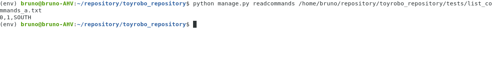
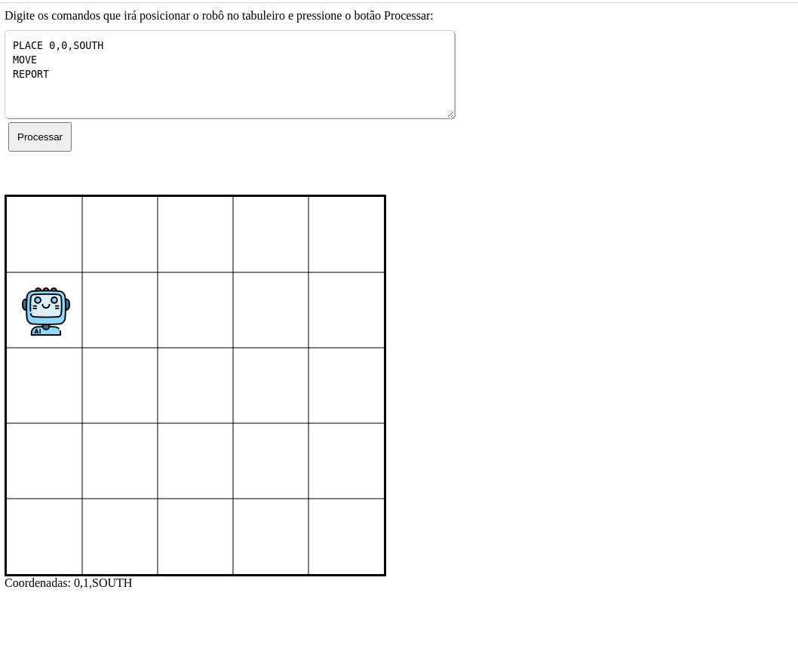

# toyrobo

Este projeto é uma aplicação que simula o movimento de um robÕ de brinquedo num
tabuleiro de dimensões 5X5. Tendo a opção CLI e também a versão web


## Instalando e iniciando o projeto

### Instalação sem container

### Pré-requisitos

Tenha o python instalado na máquina ou um virtualenv e tb o pip:

- instale as dependências executando o seguindo comando. Você pode usar virtual env para instalar as dependências:

```bash
    pip install -r requirements.txt
```

- suba o serviço executando o seguinte comando na raiz do projeto:

### para versão CLI

- Execute o comando no seguinte formato para iniciar o processo de leitura e processamento dos comandos


```python

    python manage.py readcommands <caminho do comando>

    exemplo:

    python manage.py readcommands /~/repository/toyrobo_repository/tests/list_commands_a.txt

```



### Versão Web

- Suba o servidor executando o seguinte comando: 

```python

    python manage.py runserver

```

- Acesse a url: http://127.0.0.1:8000/

- Coloque no textArea a lista de comandos para serem executados e click no botão "Processar".



- O robõ irá se movimentar no tabuleiro de acordo com os comandos processados no arquivo

### Instalando pelo docker

- Como pré-requisito, você precisa ter o docker instalado.
- Execute o comando de build no docker-compose de acordo com o exemplo abaixo:

```docker
    docker-compose build 
```

- Execute o seguinte comando para subir o container

```docker
    docker-compose up -d
```

### versão web

- Acesse a url http://localhost:8080/ e faça os mesmos passos da versão sem container


## versão CLI

Para a versão CLI com container execute o seguinte comando para copiar o arquivo de comandos para dentro do container:


```docker
   docker cp ./tests/list_commands_a.txt toyrobo:/container
```

neste exemplo o comando tem o seguinte formato: 
 docker cp [path do arquivo de origem]  [nome do container]:[nome do arquivo de destino]

Agora execute o comando que será executado o processador de comandos escrevendo o seguinte comando:

```docker
   docker exec -it toyrobo python manage.py readcommands /container/list_commands_a.txt

O comando acima tem o seguinte formato:

docker exec -it [nome do container] python manage.py readcommands /container/[path do arquivo copiado anteriormente]


